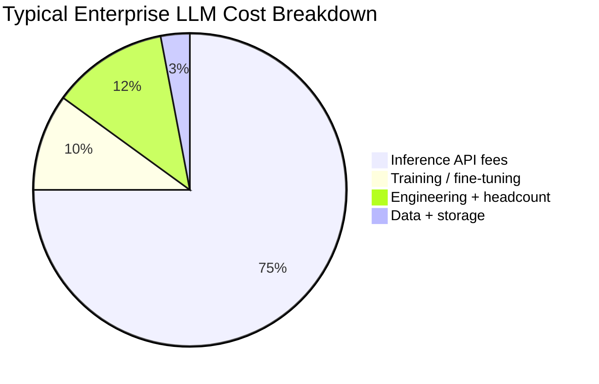
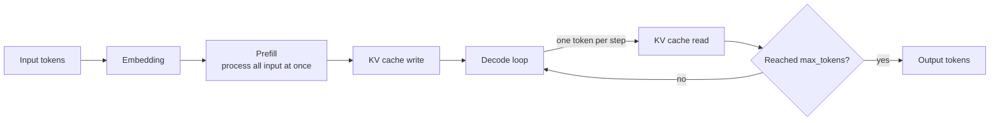
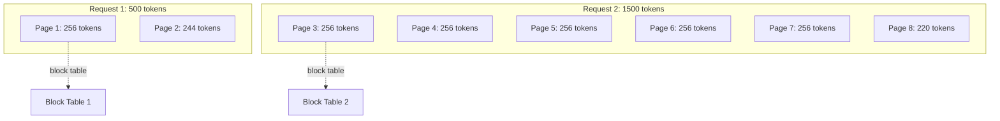
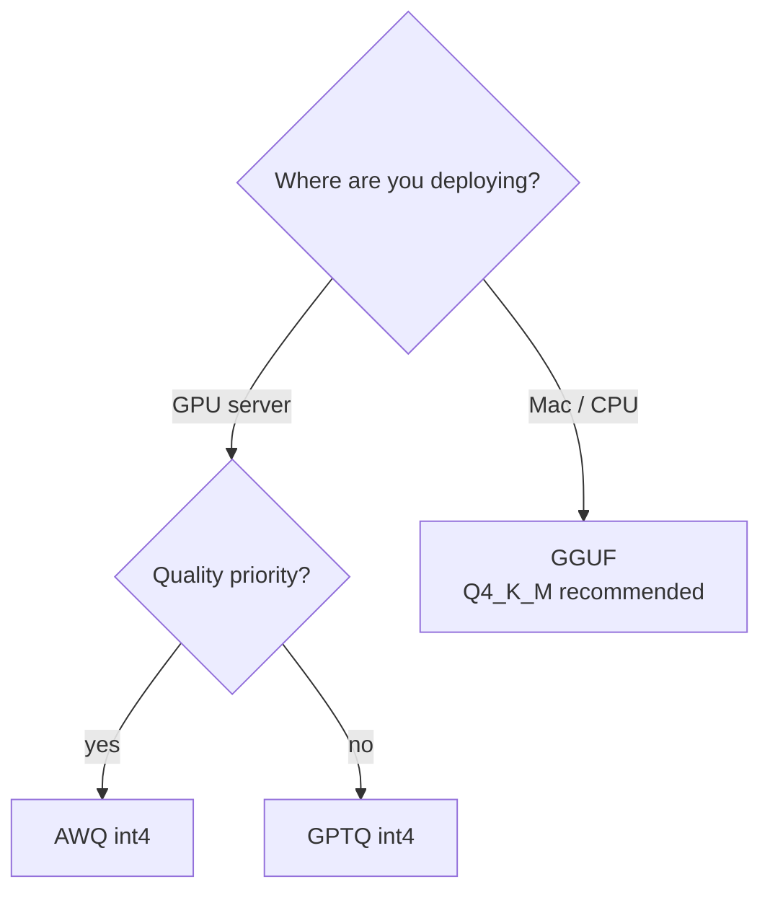
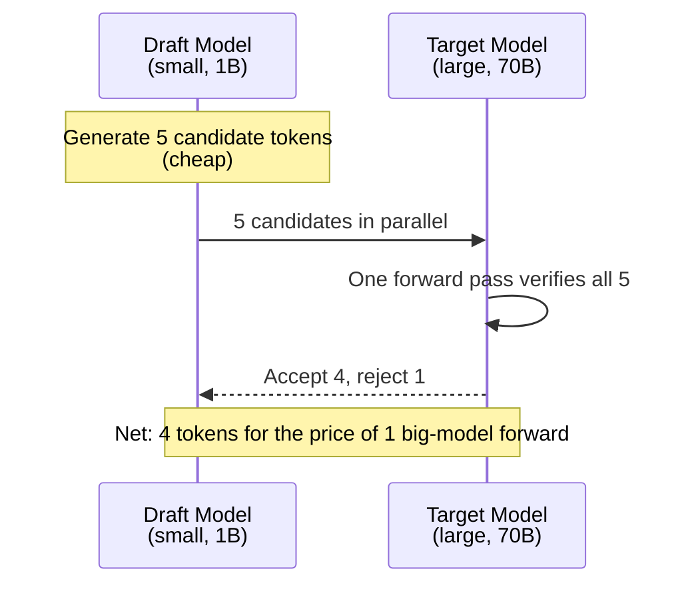
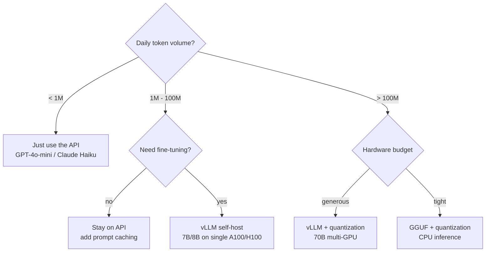

import Mermaid from '../../../components/Blog/Mermaid';

## Why This Post Exists

My earlier [LLM Cost & Performance Optimization](/en/blog/llm-cost-and-performance) covered the **application layer** — prompt cache, semantic cache, streaming, model routing. This one goes one level deeper: the **inference engine** itself.

If your LLM app calls an API fewer than 100K times a day, **just use the API** and skip this. But if you're:

- Self-hosting open-source models (70B+ on H100s)
- Running high-QPS inference (>50 concurrent)
- Handling long contexts (>32K tokens)
- Deploying at the edge on a budget

Then vLLM, PagedAttention, quantization, and speculative decoding are **the four things to know**. No paper derivations — just production takeaways and runnable code.

## 1. Why Inference Dominates the Bill

Most people assume training is expensive and inference is cheap. **It's the other way around**:



- Training is one-time; inference burns every day
- Self-hosting a 7B model on A100: 1M input + 1M output tokens ≈ $0.50
- Same tokens on GPT-4o-mini ≈ $0.30
- **The numbers look close, but self-hosting is controllable, fine-tunable, and uncensored**

Latency splits into two distinct kinds:

| Metric | Meaning | Typical (7B + vLLM) |
|---|---|---|
| **TTFT** (Time To First Token) | First-token latency, prefill phase | 200-500ms |
| **TPOT** (Time Per Output Token) | Per-token latency, decode phase | 20-50ms |
| **Total latency** | TTFT + TPOT × output length | depends on max_tokens |

**Prefill is compute-bound** (GEMM-heavy). **Decode is memory-bandwidth-bound** (one token at a time, repeatedly reads the KV cache). Two phases, two different bottlenecks, two different optimization playbooks.

## 2. Anatomy of an Inference Pass

One prompt to response, end-to-end:



**KV cache** is the centerpiece — it caches each token's K/V matrices so decode doesn't recompute. But it **eats VRAM**:

```
7B model + fp16 + 32K context + 32 layers × 2 (K,V) × 4096 dim × 32K seq × 2 bytes
≈ 14 GB (weights) + 17 GB (KV cache, single request)
≈ 31 GB per request
```

**A single request needs 31GB**. An A100 has 80GB. batch=2 already OOMs.

That's where PagedAttention rescues us.

## 3. vLLM + PagedAttention

### The problem: KV cache fragmentation

Traditional inference engines (HuggingFace Transformers, early TGI versions) **pre-allocate** KV cache for the maximum sequence length. If max_seq_len=2048 but the request only has 500 tokens, **1500 tokens of space is wasted**. Under concurrency, fragmentation compounds.

### The solution: steal the OS virtual memory idea

PagedAttention chops KV cache into **fixed-size pages** (think 4KB OS pages), allocating on demand:



Each request keeps a **block table** mapping logical pages to physical pages. Fragmentation drops to ~0; VRAM utilization goes from ~30% to ~95%.

Real-world numbers:

| Engine | 7B + A100 + 32 concurrent | Throughput (tokens/s) |
|---|---|---|
| HuggingFace Transformers | OOM @ batch=4 | ~200 |
| TGI (pre-PagedAttention) | OOM @ batch=8 | ~500 |
| **vLLM** | batch=32 stable | **~2400** |

**4-12x throughput**. That's why every production inference engine switched to vLLM after 2023.

### Deploy vLLM

The minimal setup:

```bash
pip install vllm
vllm serve meta-llama/Llama-3-8B-Instruct \
  --tensor-parallel-size 1 \
  --gpu-memory-utilization 0.9 \
  --max-model-len 8192 \
  --port 8000
```

Client side:

```typescript
const res = await fetch('http://localhost:8000/v1/chat/completions', {
  method: 'POST',
  headers: { 'Content-Type': 'application/json' },
  body: JSON.stringify({
    model: 'meta-llama/Llama-3-8B-Instruct',
    messages: [{ role: 'user', content: 'Hello' }],
    max_tokens: 256,
    temperature: 0.7,
  }),
});
const { choices } = await res.json();
```

**OpenAI-compatible API** — your existing client code switches with zero changes.

### Bonus: continuous batching

Traditional batching waits for the slowest request to finish (static batching). vLLM's continuous batching lets **finished requests leave immediately and new ones join any time**. The GPU never idles, throughput goes up another ~30%.

## 4. Quantization: The 4 Options Compared

Quantization's core idea: **store weights in fewer bits**, trading a tiny bit of quality for VRAM and speed.

| Method | Granularity | VRAM savings | Quality loss | Speedup | Best for |
|---|---|---|---|---|---|
| **GPTQ** | per-group (128) | 4x (fp16 → int4) | small | 1.5-2x | GPU inference |
| **AWQ** | per-channel, activation-aware | 4x | tiny | 1.5-2x | GPU inference, **slightly more accurate than GPTQ** |
| **GGUF** | mixed (Q4_K_M etc.) | 4-8x | small | slow | **CPU inference** (Mac, edge) |
| **bitsandbytes** | dynamic NF4 | 4x | medium | slow | loading during training, **not for inference** |

**Decision tree**:



### Quantize a model with AWQ

```bash
pip install autoawq
```

```python
from awq import AutoAWQForCausalLM
from transformers import AutoTokenizer

model_path = "meta-llama/Llama-3-8B-Instruct"
quant_path = "Llama-3-8B-Instruct-AWQ"

# Quantize
model = AutoAWQForCausalLM.from_pretrained(model_path)
tokenizer = AutoTokenizer.from_pretrained(model_path)
model.quantize(tokenizer, quant_config={ "zero_point": True, "q_group_size": 128 })
model.save_quantized(quant_path)
tokenizer.save_pretrained(quant_path)
```

Deploy to vLLM:

```bash
vllm serve Llama-3-8B-Instruct-AWQ \
  --quantization awq \
  --max-model-len 8192
```

**VRAM: 16GB → 5GB. Throughput: 1.8x. Quality loss: < 1% on HumanEval**.

### Run a 70B model on Mac with GGUF

```bash
brew install ollama
ollama pull llama3:70b-instruct-q4_K_M
# 70B quantized = 40GB, M2 Ultra 192GB unified memory can host it
```

## 5. Speculative Decoding: Free 2-3x Speedup

The most elegant technique: **let a small model generate candidates, let the big model verify, zero quality loss**.

### How it works



**Key insight**: a large model *verifying* 5 tokens in parallel is faster than *generating* 1 token sequentially. If acceptance is high, you win 5x; if low, you fall back to normal decode with no loss.

### Enable speculative decoding in vLLM

```bash
vllm serve meta-llama/Llama-3-70B-Instruct \
  --speculative-model meta-llama/Llama-3-8B-Instruct \
  --num-speculative-tokens 5 \
  --use-v2-block-manager
```

Benchmark:

| Scenario | Normal decode | Speculative | Speedup |
|---|---|---|---|
| Short answer (50 tokens) | 1.2s | 0.5s | 2.4x |
| Long code gen (1000 tokens) | 18s | 6.5s | 2.8x |
| Creative writing (high entropy) | 22s | 12s | 1.8x |

**Cost**: 2x VRAM (both draft and target loaded). **Don't use it when VRAM is tight**.

### Pick the wrong draft model — common trap

- Don't go too small (`<1B` → acceptance rate collapses → no speedup)
- Draft must be the **same family** as target (Llama-3-8B for Llama-3-70B ✓; Qwen-0.5B for Llama-70B ✗)
- For fine-tuned targets, pick a draft from the **same fine-tune lineage**

## 6. Production Decision Tree



## 7. Real Production War Stories

### War story 1: OOM at long context

32K context + 7B + 4 concurrent → OOM.

**Fix**:

```bash
vllm serve model \
  --max-model-len 32768 \
  --gpu-memory-utilization 0.85 \
  --swap-space 4  # 4GB CPU swap as last-resort
```

Or use **sliding window attention** (Mistral, Qwen-2.5 default) to cap KV growth.

### War story 2: Throughput cliff at high concurrency

Going from 32 → 64 concurrent: throughput *dropped* instead of rising. Root cause: long contexts (>8K) make prefill eat the entire batch budget.

**Fix**: split long requests at the application layer.

```python
def smart_truncate(prompt: str, max_tokens: int = 4000) -> str:
    if len(prompt) > max_tokens * 4:  # ~4 chars per token rough estimate
        return prompt[:max_tokens * 4] + "\n\n[... middle truncated ...]\n\n" + prompt[-2000:]
    return prompt
```

Or use vLLM's `--enable-prefix-caching` to auto-cache the shared system prompt.

### War story 3: Quantizing a fine-tuned model degrades quality

AWQ on a LoRA-fine-tuned model → noticeably worse than full precision. Reason: fine-tune weight perturbations get amplified by quantization.

**Fix**:

- **QLoRA**: fine-tune on top of 4-bit quantization (recommended)
- Quantize **after** fine-tuning (preserves the baseline)
- Run HumanEval / MMLU after quant to verify

### War story 4: Speculative decoding falls apart with mismatched templates

If draft and target use different chat templates (one ChatML, one Llama-3 format), acceptance rate drops below 30% — effectively no speedup.

**Fix**: always use the **same model family** (Llama-3-8B for Llama-3-70B-Instruct) so tokenizer and chat template match.

## 8. How This Stacks With Application-Layer Optimization

Inference optimization and [LLM Cost & Performance Optimization](/en/blog/llm-cost-and-performance) are **different layers — they compose**:

| Layer | Techniques | Savings |
|---|---|---|
| **Application** | Prompt cache, semantic cache, streaming, routing | 40-60% |
| **Inference** | vLLM, quantization, speculative | 50-80% |
| **Model** | Smaller model, distillation, merging | 30-50% |

All three stacked = **80-90% combined savings**. A real project went from $5000/month on GPT-4 to $400/month on self-hosted 7B with all three layers.

## TL;DR

| Technique | VRAM | Throughput | Quality | Complexity | When |
|---|---|---|---|---|---|
| **vLLM** | -60% | 4-12x | 0 | medium | **All self-hosting** |
| **AWQ quant** | -75% | 1.8x | < 1% | low | VRAM is tight |
| **GGUF** | -75% | slow | < 1% | low | **CPU / edge** |
| **Speculative** | +100% | 2-3x | 0 | medium | **High QPS + VRAM to spare** |

**One-liner**: production LLM self-hosting = **vLLM + AWQ quant + Speculative** (if VRAM allows). API users don't need this post.

Next up: [LLM Guardrails](/en/blog/llm-guardrails) — the safety lines you must add once your LLM app is public. Complementary to this post's "save money" — that's "don't blow up."

## References

- [vLLM paper (SOSP'23)](https://arxiv.org/abs/2309.06180) — PagedAttention original paper
- [vLLM docs](https://docs.vllm.ai/) — deployment, config, perf tuning
- [Flash Attention 2](https://github.com/Dao-AILab/flash-attention) — the dependency under the hood
- [Speculative Decoding paper](https://arxiv.org/abs/2211.17192) — DeepMind's original
- [AWQ paper](https://arxiv.org/abs/2306.00978) — Activation-aware Weight Quantization
- [AutoAWQ GitHub](https://github.com/casper-hansen/AutoAWQ) — quantization tool
- [Hugging Face Optimum](https://huggingface.co/docs/optimum) — cross-framework inference optimization
- [llama.cpp](https://github.com/ggerganov/llama.cpp) — CPU / Apple Silicon inference
