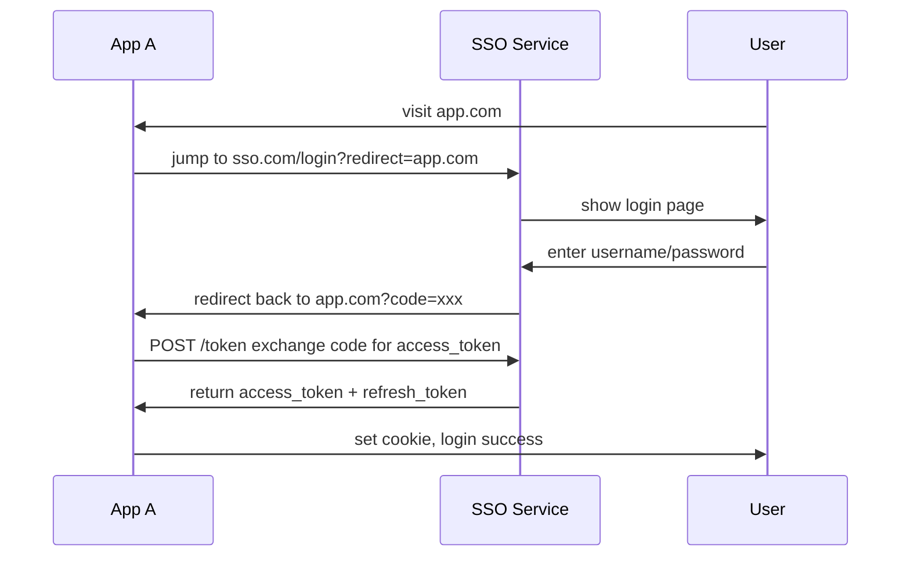

import Mermaid from '../../../components/Blog/Mermaid';
import AIAsk from '../../../components/Blog/AIAsk.astro';

## Introduction

Should a frontend architect understand permissions? My answer is **yes** — not to write RBAC libraries, but to build the engineering judgment of "how to embed permission systems into frontend architecture". Three reasons:

1. **The "SSO unified permission project" on resume is real experience.** Permission system is **the gateway of enterprise-grade systems**, without it = any business module has security risks.
2. **Permissions = security / UX / performance trade-off.** Frontend permission too strict = bad UX, too loose = security holes. **Architects must balance**.
3. **RBAC + OAuth + JWT is the modern permission system standard combination.** Understanding these three technologies, **you can design framework-independent permission solutions**.

This is post #27 of the *Frontend Architecture Cultivation Path* series. We skip specific implementation (no Passport.js config), use architecture diagrams + design philosophy + real cases to make RBAC model / dynamic routes / SSO / JWT concrete. The next post deep-dives into client-side AI and front-end architecture future.

## 1. RBAC Model: Roles + Permissions

<Mermaid client:load caption="Figure 1: RBAC core model" chart={`flowchart LR
  U[User] -->|belongs to| R[Role]
  R -->|has| P[Permission]
  P -->|acts on| RES[Resource]
  U -->|directly holds| P2[Permission<br/>special case]`} />

**Core three-piece set**:
- **User**
- **Role** (e.g., admin / manager / user)
- **Permission** (e.g., `user:read` / `user:edit` / `user:delete`)

**Relationships**:
- User belongs to 1+ Role
- Role has 1+ Permission
- Permission acts on Resource + Action (e.g., `user` resource + `read` action)

## 2. Frontend Permission Check Three-Piece Set

### 2.1 Route Level: Dynamic Routes

```typescript
// Route config
const routes = [
  {
    path: '/admin',
    component: AdminLayout,
    meta: { requiresAuth: true, roles: ['admin'] },
    children: [
      { path: 'users', component: UserList, meta: { permissions: ['user:read'] } },
      { path: 'users/new', component: UserCreate, meta: { permissions: ['user:create'] } },
    ],
  },
];

// Route guard
router.beforeEach((to, from, next) => {
  if (!to.meta.requiresAuth) return next();
  if (!authStore.token) return next('/login');
  if (to.meta.roles && !to.meta.roles.some(r => authStore.hasRole(r))) {
    return next('/forbidden');
  }
  if (to.meta.permissions && !to.meta.permissions.every(p => authStore.hasPermission(p))) {
    return next('/forbidden');
  }
  next();
});
```

**Architect's mantra**: **Route-level permission = first gate**. **No permission = directly jump to /forbidden**, don't render the component.

### 2.2 Component Level: usePermission

```tsx
function usePermission(action: string, resource: string) {
  const { permissions } = useAuth();
  return permissions.includes(`${resource}:${action}`);
}

function UserList() {
  const canEdit = usePermission('edit', 'user');
  
  return (
    <div>
      <Table dataSource={users} />
      {canEdit && <Button>Edit</Button>}
    </div>
  );
}
```

**Architect's mantra**: **Component-level permission = hide UI**. **No permission = button doesn't render**, not disabled.

### 2.3 API Level: Axios Interceptor

```typescript
// Axios interceptor
axios.interceptors.response.use(
  response => response,
  error => {
    if (error.response?.status === 401) {
      // token expired, jump to login
      authStore.logout();
      router.push('/login');
    }
    if (error.response?.status === 403) {
      // insufficient permission
      toast.error('No permission');
    }
    return Promise.reject(error);
  }
);
```

**Architect's mantra**: **API interceptor = last gate**. Even if frontend checks pass, **backend must re-validate** (frontend code can be bypassed).

## 3. JWT: JSON Web Token

```typescript
// JWT structure
const token = `${header}.${payload}.${signature}`;

// Verify token
function verifyToken(token: string): { valid: boolean; user?: User } {
  const [, payload, signature] = token.split('.');
  
  // 1. Verify signature
  if (verifySignature(payload, signature, PUBLIC_KEY) === false) {
    return { valid: false };
  }
  
  // 2. Check expiration
  const claims = JSON.parse(atob(payload));
  if (claims.exp < Date.now() / 1000) {
    return { valid: false };
  }
  
  return { valid: true, user: claims.user };
}
```

**JWT three blocks**:
- **Header** (algorithm info)
- **Payload** (user info + expiration + permissions)
- **Signature** (server signature)

**Architect's mantra**: **Access Token short + Refresh Token long**. Access 15min expiry, Refresh 7 days, **refresh auto-exchanges access**.

## 4. SSO Single Sign-On: OAuth 2.0 + JWT



**SSO three benefits**:
- **User logs in once**, all apps share
- **Centralized permission management** — change permissions, all apps affected
- **Unified audit** — all login records in one place

**Production case**: SF Express ERP + Rouyu admin + financial reporting + internal IM all use the same SSO, **user logs in once, full company access**.

## 5. JWT Storage: localStorage vs Cookie vs Memory

| Storage | XSS risk | CSRF risk | Use case |
|---|---|---|---|
| `localStorage` | **High** (JS readable) | Low (not auto-sent) | ❌ Not recommended |
| `sessionStorage` | **High** | Low | Short sessions |
| **HttpOnly Cookie** | Low | High (auto-sent) | **Recommended** + SameSite=Lax |
| Memory (variable) | **Zero** (lost on refresh) | Zero | Short sessions + high sensitivity |

**Architect's decision**: **JWT default storage is HttpOnly Cookie + SameSite=Lax**. **OAuth callback uses temporary localStorage**, **immediately move to HttpOnly Cookie after login**.

## 6. Dynamic Menu / Route: Generated Based on Permissions

```typescript
// Backend returns permission list → frontend generates menu dynamically
const userPermissions = ['user:read', 'user:edit', 'order:read'];

const allMenus = [
  { path: '/users', label: 'Users', permission: 'user:read' },
  { path: '/orders', label: 'Orders', permission: 'order:read' },
  { path: '/settings', label: 'Settings', permission: 'settings:read' },
];

const visibleMenus = allMenus.filter(m => 
  userPermissions.includes(m.permission)
);

// Render
visibleMenus.map(m => <MenuItem>{m.label}</MenuItem>)
```

**Architect's mantra**: **Menu / route meta info all carry permission**, **filter based on user permissions** — **business-side doesn't need to manually control menu visibility**.

## 7. Pitfall Reminders (Senior Architects Please Read Carefully)

1. **Don't put permission checks only in frontend.** **Frontend code can be bypassed** — **F12 / debugger / user-modified requests**, **backend must re-validate**. Frontend is UX, backend is security.
2. **Don't store permissions in localStorage.** **XSS one-line theft** — **HttpOnly Cookie + SameSite=Lax** is 2024 standard.
3. **Don't make Access Token long-lived.** **Access Token 15min**, Refresh Token 7 days. **Token leaked = short window impact**.
4. **Don't confuse RBAC with ABAC.** **RBAC** = role-level (coarse); **ABAC** = attribute-level (fine, "user = department = X to see"). **Choose by business complexity, don't mix**.
5. **Don't be lazy on SSO design.** **SSO is enterprise system entry** — **Token encryption / HTTPS / callback URL whitelist / CSRF protection** all required.

## Summary

Six key facts that thread RBAC permission system together:

- **RBAC model**: User → Role → Permission → Resource, clear role / permission separation.
- **Three-layer permission check**: route level (dynamic routes) + component level (usePermission) + API level (Axios interceptor), **frontend UX + backend security**.
- **JWT structure**: Header + Payload + Signature, Access short + Refresh long standard pattern.
- **SSO single sign-on**: OAuth 2.0 + JWT, one login full company access, centralized permissions + audit.
- **JWT stored in HttpOnly Cookie**: localStorage high XSS risk, Cookie + SameSite=Lax is 2024 standard.
- **Dynamic menu / route**: meta info carries permission, frontend filters by user permission, **business-side zero intervention**.

**Next post**: Client-side AI and front-end architecture future — Web LLM / Chrome AI / CopilotKit, front-end architects' must-master new AI era approaches.

## 5 Key Interview Question Tracks

> This section maps one-to-one with the article. **Q1 ships with a complete answer as a model**; the other four are for you to think through — each one is followed by an AI assistant button for a one-click detailed answer.

> **Q1 (Answer)**: What are the three pieces of the RBAC model? Why is permission checked in three layers (route / component / API)?
>
> **A**: **RBAC three pieces**: User + Role + Permission, Permission acts on Resource + Action. **Three-layer check division**: ① **Route level** — jump to /forbidden to prevent entry; ② **Component level** — hide UI (button doesn't render); ③ **API level** — backend last fallback, **prevents F12 bypass**. **Architect's mantra**: **Route manages entry, component manages visuals, API manages security** — all three required.<AIAsk question="What are the three pieces of the RBAC model? Why is permission checked in three layers (route / component / API)?" lang="en" />
>
> **Q2 (Think)**: What are the risks of storing JWT in localStorage / Cookie / Memory? How to choose in 2024?
>
> **A**: **localStorage** — **high XSS risk** (JS readable, XSS one-line theft), not recommended; **sessionStorage** — same as localStorage, lost when closing tab; **HttpOnly Cookie** — **low XSS + CSRF protection with SameSite=Lax** is 2024 standard; **Memory** — zero risk but lost on refresh, only for high-sensitivity short-term. **Architect's decision**: **Access Token stored in HttpOnly Cookie + SameSite=Lax**; **Refresh Token separate HttpOnly Cookie**; **OAuth callback uses temporary localStorage**, **immediately move to Cookie after login**.<AIAsk question="What are the risks of storing JWT in localStorage / Cookie / Memory? How to choose in 2024?" lang="en" />
>
> **Q3 (Think)**: How is SSO single sign-on implemented? What's the workflow of OAuth 2.0 authorization code mode?
>
> **A**: **SSO workflow**: **User visits app.com** → jump to **sso.com/login?redirect=app.com** → SSO shows login page → **User enters password** → SSO jumps back to app.com with **code=xxx** → **app.com uses code to exchange for access_token + refresh_token** → set Cookie / jump complete. **Key points**: ① **OAuth authorization code mode** is the most secure — **code can only be used once + short expiration**; ② **PKCE** (Proof Key for Code Exchange) prevents code hijacking; ③ **Callback URL whitelist** — SSO only jumps to pre-registered domains.<AIAsk question="How is SSO single sign-on implemented? What's the workflow of OAuth 2.0 authorization code mode?" lang="en" />
>
> **Q4 (Think)**: Frontend permission check can be bypassed, why still do it? How does backend fallback?
>
> **A**: **Frontend permission is UX, not security** — **F12 modify state / intercept fetch / modify localStorage** all bypass, **so**: **frontend does permission** = **better UX** (user doesn't see "delete" button and click to fail), **backend does permission** = **safety guarantee** (every API must re-validate). **Backend fallback three-piece set**: ① **Middleware** — Express / Koa / Spring route guard; ② **Decorator** — `@RequiresPermissions('user:edit')` at controller entry; ③ **Database Row-Level Security** — user can only query own data. **No frontend permission = bad UX; no backend permission = vulnerability**.<AIAsk question="Frontend permission check can be bypassed, why still do it? How does backend fallback?" lang="en" />
>
> **Q5 (Think)**: In your SF Express SSO unified permission project, how did you design it? How to centrally manage permissions across multiple subsystems?
>
> **A**: **SSO unified permission design**: ① **Central authentication service** — single sign-on, all subsystems jump to login; ② **Unified user center** — users / roles / permissions centrally managed, change once affects all; ③ **OAuth 2.0 authorization code mode** + **JWT** — subsystems use code to exchange for access_token; ④ **Layered permissions** — global role (platform level) + business role (subsystem level), supports "one user is admin in ERP, user in financial system"; ⑤ **Audit** — all login / permission changes logged to ELK, **security team can check**. **Effect**: 10+ subsystems one login full access, permission changes once effective, **saves 80% duplicate login + permission management cost**.<AIAsk question="In your SF Express SSO unified permission project, how did you design it? How to centrally manage permissions across multiple subsystems?" lang="en" />

> 💡 Each question has an AI assistant button — one click gets you a detailed answer.

## References

- [OAuth 2.0 (RFC 6749)](https://www.rfc-editor.org/rfc/rfc6749) — OAuth 2.0 official spec
- [JWT (RFC 7519)](https://www.rfc-editor.org/rfc/rfc7519) — JWT official spec
- [OWASP Authorization Cheat Sheet](https://cheatsheetseries.owasp.org/cheatsheets/Authorization_Cheat_Sheet.html) — OWASP permissions checklist
- [Casbin (GitHub)](https://github.com/casbin/casbin) — general-purpose permission library
- [Auth0 Documentation](https://auth0.com/docs) — Auth0 documentation reference
- [Keycloak Documentation](https://www.keycloak.org/documentation.html) — open-source SSO solution