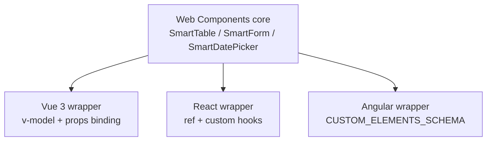
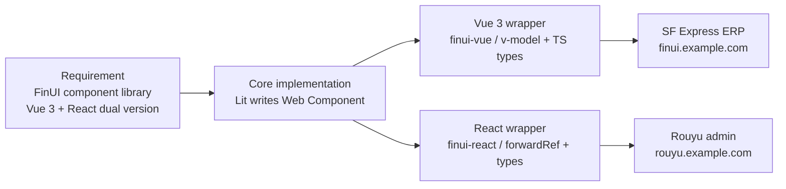

import Mermaid from '../../../components/Blog/Mermaid';
import AIAsk from '../../../components/Blog/AIAsk.astro';

## Introduction

Should a frontend architect understand Web Components? My answer is **yes** — not to use Lit / Stencil, but to build the engineering judgment of "the core abstraction layer of cross-framework component libraries". Three reasons:

1. **The 8 cross-Vue/React universal components on resume is scarce experience.** The core of cross-framework component libraries is Web Components + framework wrapper, **understanding this lets you design framework-independent components**.
2. **Web Components is a browser standard.** Unlike React-only React, **Custom Elements run in all frameworks** — Vue / React / Angular / Solid / Svelte can all consume.
3. **The next 5 years' cross-platform component library trend.** Lit 3.0 / Lit SSR / Web Components + Signals / cross-framework component library design, **all underneath is Web Components**.

This is post #20 of the *Frontend Architecture Cultivation Path* series. We skip Lit's specific API (no `LitElement` inheritance details), use architecture diagrams + design philosophy + real cases to make Web Components' three core technologies + 8 cross-framework components design concrete. The next post deep-dives into front-end monitoring.

## 1. Web Components Three Core Technologies

<Mermaid client:load caption="Figure 1: Web Components three core technologies" chart={`flowchart LR
  WC[Web Components] --> CE[Custom Elements<br/>custom HTML tags]
  WC --> SD[Shadow DOM<br/>style + structure isolation]
  WC --> ES[HTML Templates<br/>slot content projection]`} />

**Three core technologies**:

1. **Custom Elements**: `customElements.define('my-tag', ...)` registers custom HTML tags
2. **Shadow DOM**: component's internal DOM / styles / behavior fully isolated, **doesn't affect outside**
3. **HTML Templates**: `<template>` + `<slot>` for reusable templates + content distribution

## 2. Custom Elements: Define Your Own HTML Tags

```javascript
// smart-table.ts — a Web Component
class SmartTable extends HTMLElement {
  static get observedAttributes() {
    return ['columns', 'data-source', 'page-size'];
  }
  
  connectedCallback() {
    this.render();
  }
  
  attributeChangedCallback() {
    this.render();
  }
  
  render() {
    const columns = JSON.parse(this.getAttribute('columns') || '[]');
    const dataSource = this.getAttribute('data-source');
    // render table
    this.shadowRoot.innerHTML = `
      <table>
        <thead>
          ${columns.map(c => `<th>${c.label}</th>`).join('')}
        </thead>
        <tbody>
          <slot></slot>
        </tbody>
      </table>
    `;
  }
}

customElements.define('smart-table', SmartTable);
```

**Usage (any framework)**:

```html
<!-- Pure HTML -->
<smart-table columns="[{"key":"name","label":"Name"}]" data-source="/api/users">
  <tr><td>Alice</td></tr>
</smart-table>

<!-- Vue 3 -->
<smart-table :columns="cols" :data-source="apiUrl">
  <tr v-for="row in data" :key="row.id"><td>{{ row.name }}</td></tr>
</smart-table>

<!-- React -->
<smartTable columns={JSON.stringify(cols)} dataSource="/api/users">
  {data.map(row => <tr key={row.id}><td>{row.name}</td></tr>)}
</smartTable>
```

**Advantages**: **one component, usable in Vue / React / Angular / Solid**.

## 3. Shadow DOM: Component Style Isolation

```javascript
class SmartTable extends HTMLElement {
  constructor() {
    super();
    this.attachShadow({ mode: 'open' });  // 0. attach Shadow DOM
  }
  
  connectedCallback() {
    // 1. styles only affect inside Shadow DOM
    this.shadowRoot.innerHTML = `
      <style>
        .table { border-collapse: collapse; }
        th { background: #f0f0f0; padding: 8px; }
      </style>
      <table class="table">...</table>
    `;
  }
}
```

**Three benefits of Shadow DOM**:

1. **Style isolation**: component's internal `.button` won't conflict with external `.button`
2. **DOM isolation**: component's internal DOM doesn't leak to global queries
3. **Event redirection**: click events inside component can `composed: true` to bubble to outside

## 4. HTML Templates + Slot: Content Distribution

```html
<template id="smart-table-tpl">
  <style>.table { border-collapse: collapse; }</style>
  <div class="container">
    <slot name="header"></slot>  <!-- named slot -->
    <table class="table">
      <slot></slot>  <!-- default slot -->
    </table>
    <slot name="footer"></slot>
  </div>
</template>
```

**Consumer passes content**:

```html
<smart-table>
  <h1 slot="header">User List</h1>  <!-- insert header slot -->
  <tr><td>Alice</td></tr>           <!-- insert default slot -->
  <button slot="footer">Export</button> <!-- insert footer slot -->
</smart-table>
```

**Slot is Web Components version of React children / Vue slot**, **cross-framework consistent**.

## 5. 8 Cross-Vue/React Universal Components Design Philosophy

The resume line **"8 cross-Vue/React universal components"** — the core architecture is **Web Components abstraction + framework wrapper**:



**Architect's mantra**:
- **Web Components write core logic** (state management, DOM operations, event distribution)
- **Framework wrappers only do adaptation** (props ↔ attribute mapping, events ↔ callback mapping)
- **Business code uses framework wrappers** (DX + type inference)

## 6. Lit / Stencil / Self-Implementation Selection

| Solution | Pros | Cons |
|---|---|---|
| **Lit** | Modern, TS-friendly, active ecosystem | Learning curve |
| **Stencil** | Compile-time optimization, multi-framework output | Complex config |
| **Self-implement HTMLElement** | Zero deps, flexible | Lots of work |
| **Vue / React wrap Web Components** | Reuse existing components | Still one per framework |

**Architect's decision**:
- **New project, efficiency focused** → Lit
- **Existing Vue / React component library** → Stencil compile output
- **Extreme performance / zero deps** → Native HTMLElement

## 7. Production Practice: FinUI Cross-Framework Component Library



**Production data**:
- **8 cross-framework universal components** (SmartTable / SmartForm / SmartDatePicker / SmartSelect / SmartTree / SmartUpload / SmartModal / SmartEditor)
- **Vue 3 + React dual version sync** (change core once, both auto-sync)
- **60% maintenance cost saved** (no need to write one for Vue, one for React)

## 8. Pitfall Reminders (Senior Architects Please Read Carefully)

1. **Don't let events inside Shadow DOM not bubble.** Default events inside Shadow DOM **don't bubble to outside** — add `composed: true`.
2. **Don't use global CSS to select inside Shadow DOM.** Shadow DOM isolation is this — can't use `.my-component .button` to cross boundaries. **Expose CSS Variables** to allow changes (`--button-bg`).
3. **Don't let framework wrappers directly use attributes.** **`null` gets stringified** — must use `getAttribute()` to check null.
4. **Don't use framework state management in Web Components.** **Web Components are framework-agnostic** — use native `observedAttributes`, don't mix Redux / Pinia / Zustand.
5. **Don't ignore SSR.** Web Components default to CSR, **SSR needs lit-ssr / similar solutions**. SEO scenarios must configure.

## Summary

Six key facts that thread Web Components together:

- **Three core technologies**: Custom Elements + Shadow DOM + HTML Templates, **browser-native, cross-framework**.
- **Custom Elements**: custom HTML tags, consumable by Vue/React/Angular/Solid.
- **Shadow DOM**: style and structure isolation, **zero CSS conflicts**.
- **Slot**: cross-framework consistent content distribution mechanism.
- **Cross-framework component library**: Web Components core + framework wrapper, **8 universal components save 60% maintenance**.
- **Selection decision**: new project Lit / existing library Stencil / zero-dep native HTMLElement.

**Next post**: Front-end monitoring system — error / performance / behavior monitoring, SF Express + Rouyu two monitoring practice summaries.

## 5 Key Interview Question Tracks

> This section maps one-to-one with the article. **Q1 ships with a complete answer as a model**; the other four are for you to think through — each one is followed by an AI assistant button for a one-click detailed answer.

> **Q1 (Answer)**: What are Web Components' three core technologies? Why are Web Components the core abstraction for cross-framework component libraries?
>
> **A**: Three core technologies: ① **Custom Elements** — `customElements.define` registers custom HTML tags, usable in Vue / React / Angular / Solid; ② **Shadow DOM** — component internal DOM / style isolation, won't conflict with external CSS; ③ **HTML Templates + Slot** — cross-framework consistent content distribution mechanism. **Why it's cross-framework core abstraction**: Web Components is a **W3C standard**, natively supported by all modern browsers, **not bound to any framework**. **The 8 cross-Vue/React universal components on resume's core architecture is**: Web Components writes core logic + Vue/React wrapper does adaptation — change core once, two frameworks sync, 60% maintenance cost saved.<AIAsk question="What are Web Components' three core technologies? Why are Web Components the core abstraction for cross-framework component libraries?" lang="en" />
>
> **Q2 (Think)**: How does Shadow DOM's style isolation work? How to allow external modification of certain styles inside a Web Component?
>
> **A**: Shadow DOM implements style isolation through **CSS isolated scopes** — internal CSS only affects inside Shadow DOM, doesn't leak outside. **For external modifications** use **CSS Variables** — component defines `var(--button-bg)`, external `style="--button-bg: red"` can change. **Practice**: a cross-framework component library exposes all colors / spacing / fonts as CSS Variables, business can theme customize without breaking encapsulation.<AIAsk question="How does Shadow DOM's style isolation work? How to allow external modification of certain styles inside a Web Component?" lang="en" />
>
> **Q3 (Think)**: What are Custom Elements' lifecycles? How to listen to attribute changes?
>
> **A**: Custom Elements four lifecycles: ① `constructor()` — called on creation, must `super()` and **cannot return**; ② `connectedCallback()` — called when element inserted into DOM, **called only once**; ③ `disconnectedCallback()` — called when element removed from DOM, **cleanup side effects**; ④ `attributeChangedCallback(name, oldValue, newValue)` — called when attribute changes. **Listen to attribute changes**: define `static get observedAttributes()` on class returning attribute names array, **only these attributes' changes trigger `attributeChangedCallback`**. **Production pitfall**: `attributeChangedCallback` also fires before `connectedCallback`, **must ensure `this.shadowRoot` is already initialized at that time**.<AIAsk question="What are Custom Elements' lifecycles? How to listen to attribute changes?" lang="en" />
>
> **Q4 (Think)**: How does Web Components' event bubbling differ from React / Vue's event systems?
>
> **A**: Web Components event bubbling is affected by **Shadow DOM boundary** — **events inside Shadow DOM don't bubble to outside by default**. Solutions: ① Event `composed: true` lets event **penetrate Shadow DOM boundary**; ② Event `bubbles: true` lets event bubble. **Practice**: click button inside component, `composed: true` lets outside listen. **Production case**: SmartTable internal row click event, `composed: true` bubbles to Vue / React wrapper, business code uses `@row-click` / `onRowClick` to listen, **completely framework-agnostic**.<AIAsk question="How does Web Components' event bubbling differ from React / Vue's event systems?" lang="en" />
>
> **Q5 (Think)**: In your FinUI cross-framework component library, how did you design 8 universal components? How exactly does Web Components core + framework wrapper division of labor work?
>
> **A**: **8 universal components = SmartTable / SmartForm / SmartDatePicker / SmartSelect / SmartTree / SmartUpload / SmartModal / SmartEditor**. **Division of labor**: Web Components writes **core logic** — Shadow DOM encapsulation + Custom Elements registration + observedAttributes props listening + slot content distribution; framework wrappers only do **adaptation** — Vue uses `defineComponent + v-model` / React uses `forwardRef + useImperativeHandle`. **Practice data**: change core once, Vue 3 + React dual version sync, save 60% maintenance cost — Vue team uses `finui-vue`, React team uses `finui-react`, component library team only maintains one Lit core.<AIAsk question="In your FinUI cross-framework component library, how did you design 8 universal components? How exactly does Web Components core + framework wrapper division of labor work?" lang="en" />

> 💡 Each question has an AI assistant button — one click gets you a detailed answer.

## References

- [MDN: Web Components](https://developer.mozilla.org/en-US/docs/Web/Web_Components) — Web Components official reference
- [Lit Documentation](https://lit.dev/) — Lit official documentation
- [Custom Elements (web.dev)](https://web.dev/articles/custom-elements-v1) — Custom Elements practical guide
- [Shadow DOM (web.dev)](https://web.dev/articles/shadowdom-v1) — Shadow DOM practical guide
- [Web Components Best Practices](https://web.dev/articles/best-practices-web-components) — Web Components best practices
- [Open Web Components](https://open-wc.org/) — open-source Web Components community