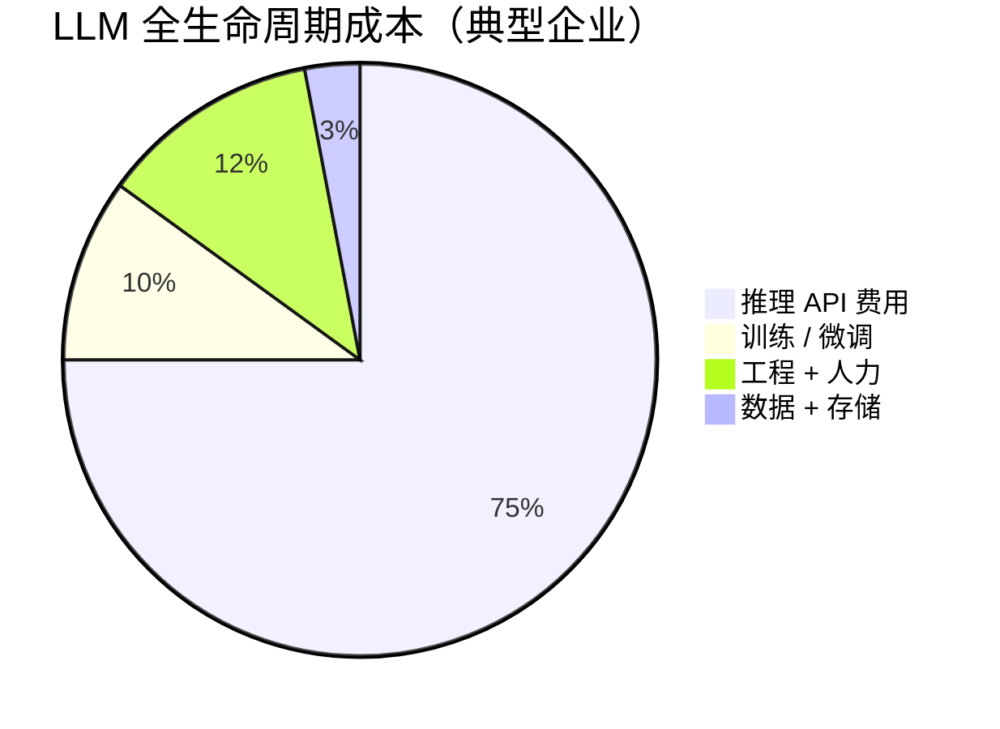
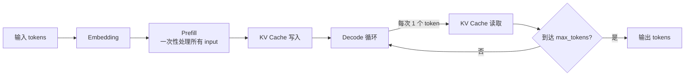
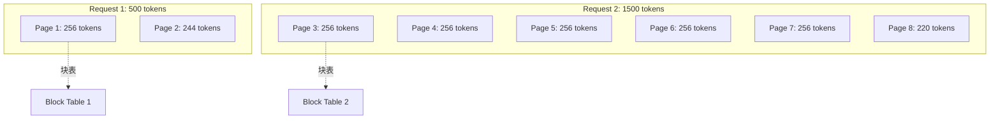
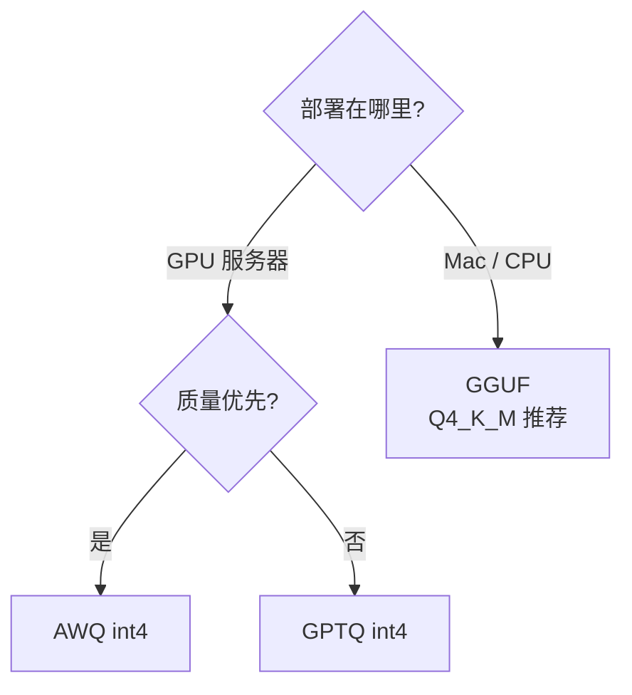
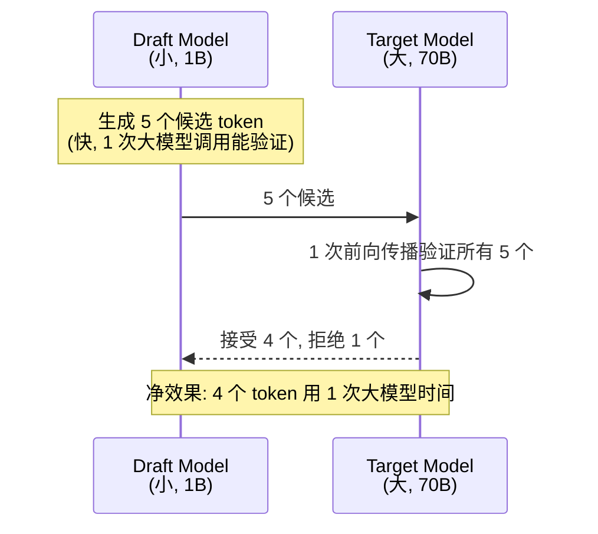
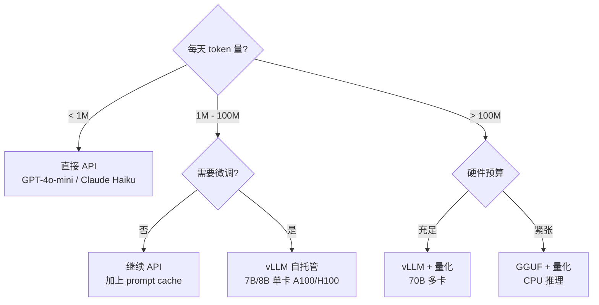

import Mermaid from '../../components/Blog/Mermaid';

## 前言

之前的 [LLM 成本与性能优化](/blog/llm-cost-and-performance) 聊的是**应用层**——prompt cache、semantic cache、流式输出、模型路由。本篇往下挖一层：**推理引擎**（inference engine）本身。

如果你的 LLM 应用每天调用不到 10 万次，**用 API 就够了**，别折腾本篇。如果你在做：

- 自托管开源模型（70B+ 在 H100 上跑）
- 高 QPS 推理服务（并发 > 50）
- 长上下文场景（> 32K tokens）
- 成本敏感的边缘部署

那 vLLM、PagedAttention、量化、Speculative Decoding 这 4 个技术**必懂**。本篇不讲论文推导，直接给生产结论和可运行的代码。

## 一、推理为什么是成本大头

很多人以为训练贵、推理便宜。**实际反过来**：



- 训练是一次性的，推理是**每天都在烧**
- 一个 7B 模型在 A100 上自托管，1M tokens 输入 + 1M tokens 输出 ≈ $0.5
- 同等 token 数调用 GPT-4o-mini ≈ $0.30
- **看着差不多，但自托管可控、可微调、无审查**

延迟也分两类：

| 指标 | 含义 | 典型值（7B + vLLM）|
|---|---|---|
| **TTFT** (Time To First Token) | 首个 token 延迟，prefill 阶段 | 200-500ms |
| **TPOT** (Time Per Output Token) | 后续每个 token 延迟，decode 阶段 | 20-50ms |
| **总延迟** | TTFT + TPOT × 输出长度 | 取决于 max_tokens |

**prefill 阶段吃计算**（GEMM 密集），**decode 阶段吃显存带宽**（每次只生成 1 个 token，KV cache 反复读取）。两阶段的瓶颈完全不同，优化手段也不同。

## 二、LLM 推理解剖

一个 token 从输入到输出，经历：



**KV cache** 是关键——它把每个 token 的 K/V 矩阵缓存起来，避免 decode 时重复计算。但它**吃显存**：

```
7B 模型 + fp16 + 32K context + 32 layers × 2 (K,V) × 4096 dim × 32K seq × 2 bytes
≈ 7B × 2 bytes + 32 × 2 × 4096 × 32768 × 2
≈ 14 GB（权重） + 17 GB（KV cache，单请求）
≈ 31 GB 单请求
```

**单请求就要 31GB 显存**。A100 才 80GB。batch=2 就爆。

这就要靠 PagedAttention 救场了。

## 三、vLLM + PagedAttention

### 问题：KV cache 碎片化

传统推理引擎（HuggingFace Transformers、tgi 早期版本）**按最大序列长度预分配** KV cache。比如 max_seq_len=2048，请求实际只有 500 tokens——1500 tokens 的空间就**浪费了**。多请求并发时，碎片化严重。

### 解法：把操作系统虚拟内存搬过来

PagedAttention 把 KV cache 切成**固定大小的 page**（类似 4KB page），按需分配：



每个请求维护一个**块表（block table）**，记录逻辑 page → 物理 page 的映射。**碎片化降为 0**，显存利用率从 ~30% 提到 ~95%。

实际效果：

| 引擎 | 7B + A100 + 32 并发 | 吞吐量（tokens/s）|
|---|---|---|
| HuggingFace Transformers | OOM @ batch=4 | ~200 |
| TGI（无 PagedAttention）| batch=8 OOM | ~500 |
| **vLLM** | batch=32 稳定运行 | **~2400** |

**4-12x 吞吐量提升**。这就是为什么 2023 年后所有生产推理都换 vLLM。

### 部署 vLLM

最简方式：

```bash
pip install vllm
vllm serve meta-llama/Llama-3-8B-Instruct \
  --tensor-parallel-size 1 \
  --gpu-memory-utilization 0.9 \
  --max-model-len 8192 \
  --port 8000
```

客户端：

```typescript
const res = await fetch('http://localhost:8000/v1/chat/completions', {
  method: 'POST',
  headers: { 'Content-Type': 'application/json' },
  body: JSON.stringify({
    model: 'meta-llama/Llama-3-8B-Instruct',
    messages: [{ role: 'user', content: 'Hello' }],
    max_tokens: 256,
    temperature: 0.7,
  }),
});
const { choices } = await res.json();
```

**OpenAI 兼容 API**——前端代码无感切换。

### 进阶：continuous batching

传统 batching 是「等最慢的请求完成才返回」（static batching）。vLLM 的 continuous batching 让**已完成的请求立刻退出，新请求随时加入**。这意味着 GPU 永远不空转，吞吐量再涨 30%。

## 四、量化：4 种方案选哪个

量化的本质：**用更少的 bit 存权重**，换更小的显存和更快的推理。

| 方案 | 粒度 | 显存节省 | 质量损失 | 速度提升 | 适用 |
|---|---|---|---|---|---|
| **GPTQ** | per-group (128) | 4x（fp16 → int4）| 小 | 1.5-2x | GPU 推理 |
| **AWQ** | per-channel 激活感知 | 4x | 极小 | 1.5-2x | GPU 推理，**比 GPTQ 略准** |
| **GGUF** | 混合（Q4_K_M 等）| 4-8x | 小 | 慢 | **CPU 推理**（Mac、边缘）|
| **bitsandbytes** | 动态 NF4 | 4x | 中 | 慢 | 训练时加载，**推理不推荐** |

**决策树**：



### 用 AWQ 量化一个模型

```bash
pip install autoawq
```

```python
from awq import AutoAWQForCausalLM
from transformers import AutoTokenizer

model_path = "meta-llama/Llama-3-8B-Instruct"
quant_path = "Llama-3-8B-Instruct-AWQ"

# 量化
model = AutoAWQForCausalLM.from_pretrained(model_path)
tokenizer = AutoTokenizer.from_pretrained(model_path)
model.quantize(tokenizer, quant_config={ "zero_point": True, "q_group_size": 128 })
model.save_quantized(quant_path)
tokenizer.save_pretrained(quant_path)
```

部署到 vLLM：

```bash
vllm serve Llama-3-8B-Instruct-AWQ \
  --quantization awq \
  --max-model-len 8192
```

**显存从 16GB → 5GB，吞吐量提升 1.8x，质量损失 < 1%（HumanEval 评估）**。

### GGUF 在 Mac 上跑 70B 模型

```bash
# 装 Ollama 或 llama.cpp
brew install ollama
ollama pull llama3:70b-instruct-q4_K_M
# 70B 量化后 40GB，M2 Ultra 192GB 内存能跑
```

## 五、Speculative Decoding：免费的 2-3x 提速

这个技术最优雅：**用小模型生成候选，大模型验证，零质量损失**。

### 原理



**关键洞察**：大模型验证 5 个 token **比生成 1 个 token 快**（因为是并行 forward）。如果接受率高，你白赚 5x 速度；如果接受率低，至少不亏（fallback 到普通 decode）。

### 在 vLLM 里开 speculative decoding

```bash
vllm serve meta-llama/Llama-3-70B-Instruct \
  --speculative-model meta-llama/Llama-3-8B-Instruct \
  --num-speculative-tokens 5 \
  --use-v2-block-manager
```

实测：

| 场景 | 普通 decode | Speculative | 加速比 |
|---|---|---|---|
| 短答案 (50 tokens) | 1.2s | 0.5s | 2.4x |
| 长代码生成 (1000 tokens) | 18s | 6.5s | 2.8x |
| 创意写作 (高随机) | 22s | 12s | 1.8x |

**代价**：需要 2x 显存（draft + target 都要加载）。**不适合显存紧张场景**。

### 选 draft model 的坑

- draft 不能太小（< 1B 接受率太低，等于没加速）
- draft 必须是 target 的**同系列小版本**（Llama-3-8B 给 Llama-3-70B 用，OK；Qwen-0.5B 给 Llama-70B 用，垃圾）
- 微调过的 target 模型要选**同源的 draft**（不能跨架构）

## 六、生产部署选型决策



## 七、踩坑实录

### 坑 1：长上下文 OOM

32K context + 7B + 4 并发 → OOM

**解决**：

```bash
vllm serve model \
  --max-model-len 32768 \
  --gpu-memory-utilization 0.85 \
  --swap-space 4  # 4GB CPU swap, 紧急兜底
```

或者**用 sliding window attention**（Mistral、Qwen-2.5 默认）来限制 KV 增长。

### 坑 2：高并发下吞吐断崖

并发从 32 → 64 时，吞吐量**不升反降**。原因：context 太长（> 8K）时，prefill 阶段开始吃光 batch 配额。

**解决**：

```python
# 应用层把长请求拆短
def smart_truncate(prompt: str, max_tokens: int = 4000) -> str:
    if len(prompt) > max_tokens * 4:  # 粗略估算 1 token ≈ 4 chars
        return prompt[:max_tokens * 4] + "\n\n[... middle truncated ...]\n\n" + prompt[-2000:]
    return prompt
```

或者用 vLLM 的 `--enable-prefix-caching`，自动缓存相同 system prompt。

### 坑 3：量化微调过的模型

AWQ 量化一个 LoRA 微调过的模型，**效果可能不如全精度**。因为微调引入的权重扰动在量化后被放大。

**解决**：

- **QLoRA**：在 4-bit 量化基础上微调（推荐）
- 量化在微调**之后**做（保证基线准确）
- 微调完跑一次 HumanEval/MMLU 验证

### 坑 4：Speculative decoding 在 chat 模板上失效

如果 draft 和 target 用了**不同的 chat template**（比如一个用 ChatML，一个用 Llama-3 格式），接受率暴跌到 30% 以下，等于没加速。

**解决**：用**同系列模型**（Llama-3-8B 给 Llama-3-70B-Instruct 用），保证 tokenizer 和 chat template 一致。

## 八、和应用层优化的关系

推理优化和 [LLM 成本与性能优化](/blog/llm-cost-and-performance) 是**两个不同层次**，应该**叠加使用**：

| 层次 | 手段 | 节省 |
|---|---|---|
| **应用层** | Prompt cache、semantic cache、流式、路由 | 40-60% |
| **推理层** | vLLM、量化、Speculative | 50-80% |
| **模型层** | 更小模型、蒸馏、合并 | 30-50% |

**三层全做 = 综合节省 80-90%**。比如某项目从 GPT-4 $5000/月降到自托管 7B + 优化后 $400/月。

## 总结

| 技术 | 显存 | 吞吐 | 质量 | 复杂度 | 何时用 |
|---|---|---|---|---|---|
| **vLLM** | -60% | 4-12x | 0 | 中 | **所有自托管场景** |
| **AWQ 量化** | -75% | 1.8x | < 1% | 低 | 显存不够时 |
| **GGUF** | -75% | 慢 | < 1% | 低 | **CPU / 边缘** |
| **Speculative** | +100% | 2-3x | 0 | 中 | **高 QPS + 显存够** |

**一句话**：生产 LLM 自托管 = **vLLM + AWQ 量化 + Speculative**（如果显存够）。API 用户不需要本篇。

下一篇（[LLM 应用的 Guardrails](/blog/llm-guardrails)）讲公开部署后必须加的安全防线——和本篇的"省成本"互补，是"不炸"。

## 参考资料

- [vLLM 论文 (SOSP'23)](https://arxiv.org/abs/2309.06180) — PagedAttention 原理论文
- [vLLM 官方文档](https://docs.vllm.ai/) — 部署、配置、性能调优
- [Flash Attention 2](https://github.com/Dao-AILab/flash-attention) — 推理加速的底层依赖
- [Speculative Decoding 论文](https://arxiv.org/abs/2211.17192) — DeepMind 的原理论文
- [AWQ 论文](https://arxiv.org/abs/2306.00978) — Activation-aware Weight Quantization
- [AutoAWQ GitHub](https://github.com/casper-hansen/AutoAWQ) — 量化工具
- [Hugging Face Optimum](https://huggingface.co/docs/optimum) — 跨框架推理优化
- [llama.cpp](https://github.com/ggerganov/llama.cpp) — CPU / Apple Silicon 推理
