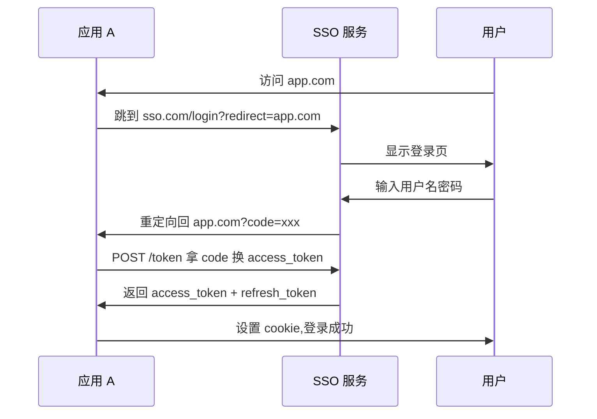

import Mermaid from '../../components/Blog/Mermaid';
import AIAsk from '../../components/Blog/AIAsk.astro';

## 前言

做前端架构的人要不要懂权限？我的回答是 **要**——不是去写 RBAC 库，而是建立"如何把权限系统嵌入到前端架构"的工程判断。原因有三：

1. **简历里"SSO 统一权限项目"是真实经验**。权限系统是**企业级系统的大门**,没做好 = 任何业务模块都有安全风险。
2. **权限 = 安全 / 体验 / 性能三者的权衡**。前端权限校验过严 = 用户体验差,过松 = 安全漏洞。**架构师必须会平衡**。
3. **RBAC + OAuth + JWT 是现代权限系统的标准组合**。理解这三种技术,**能设计独立于框架的权限方案**。

这一篇是『前端架构修仙路』的第 27 篇。我跳过具体实现（不讲 Passport.js 怎么配），用架构图 + 设计哲学 + 真实案例，把 RBAC 模型 / 动态路由 / SSO / JWT 讲透。下一篇深度聊端侧 AI 与前端架构未来。

## 一、RBAC 模型：角色 + 权限

<Mermaid client:load caption="图 1：RBAC 核心模型" chart={`flowchart LR
  U[User 用户] -->|属于| R[Role 角色]
  R -->|拥有| P[Permission 权限]
  P -->|作用于| RES[Resource 资源]
  U -->|直接持有| P2[Permission<br/>特殊情况]`} />

**核心三件套**：
- **User**（用户）
- **Role**（角色，如 admin / manager / user）
- **Permission**（权限，如 `user:read` / `user:edit` / `user:delete`）

**关系**：
- User 属于 1+ Role
- Role 拥有 1+ Permission
- Permission 作用于 Resource + Action（如 `user` 资源 + `read` 动作）

## 二、前端权限检查三件套

### 2.1 路由级：动态路由

```typescript
// 路由配置
const routes = [
  {
    path: '/admin',
    component: AdminLayout,
    meta: { requiresAuth: true, roles: ['admin'] },
    children: [
      { path: 'users', component: UserList, meta: { permissions: ['user:read'] } },
      { path: 'users/new', component: UserCreate, meta: { permissions: ['user:create'] } },
    ],
  },
];

// 路由守卫
router.beforeEach((to, from, next) => {
  if (!to.meta.requiresAuth) return next();
  if (!authStore.token) return next('/login');
  if (to.meta.roles && !to.meta.roles.some(r => authStore.hasRole(r))) {
    return next('/forbidden');
  }
  if (to.meta.permissions && !to.meta.permissions.every(p => authStore.hasPermission(p))) {
    return next('/forbidden');
  }
  next();
});
```

**架构师心法**：**路由级权限 = 第一道闸**。**没权限 = 直接跳 /forbidden**,不渲染组件。

### 2.2 组件级：usePermission

```tsx
function usePermission(action: string, resource: string) {
  const { permissions } = useAuth();
  return permissions.includes(`${resource}:${action}`);
}

function UserList() {
  const canEdit = usePermission('edit', 'user');
  
  return (
    <div>
      <Table dataSource={users} />
      {canEdit && <Button>编辑</Button>}
    </div>
  );
}
```

**架构师心法**：**组件级权限 = 隐藏 UI**。**没权限 = 按钮不渲染**,不是 disabled。

### 2.3 API 级：Axios 拦截器

```typescript
// Axios 拦截器
axios.interceptors.response.use(
  response => response,
  error => {
    if (error.response?.status === 401) {
      // token 过期,跳登录
      authStore.logout();
      router.push('/login');
    }
    if (error.response?.status === 403) {
      // 权限不足
      toast.error('没有权限');
    }
    return Promise.reject(error);
  }
);
```

**架构师心法**：**API 拦截器 = 最后一道闸**。即使前端校验通过,**后端必须二次校验**(前端代码可以被绕过)。

## 三、JWT：JSON Web Token

```typescript
// JWT 结构
const token = `${header}.${payload}.${signature}`;

// 验证 token
function verifyToken(token: string): { valid: boolean; user?: User } {
  const [, payload, signature] = token.split('.');
  
  // 1. 验签
  if (verifySignature(payload, signature, PUBLIC_KEY) === false) {
    return { valid: false };
  }
  
  // 2. 检查过期
  const claims = JSON.parse(atob(payload));
  if (claims.exp < Date.now() / 1000) {
    return { valid: false };
  }
  
  return { valid: true, user: claims.user };
}
```

**JWT 三大块**：
- **Header**（算法信息）
- **Payload**（用户信息 + 过期时间 + 权限）
- **Signature**（服务器签名）

**架构师心法**：**Access Token 短 + Refresh Token 长**。Access 15min 过期,Refresh 7 天,**refresh 自动换 access**。

## 四、SSO 单点登录：OAuth 2.0 + JWT



**SSO 三大好处**：
- **用户一次登录**,所有应用共享
- **集中权限管理**——权限改了,所有应用生效
- **统一审计**——所有登录记录在一个地方

**生产案例**：顺丰 ERP + 柔宇管理后台 + 财报系统 + 内部 IM 全部接同一个 SSO,**用户一次登录全公司通行**。

## 五、JWT 存储：localStorage vs Cookie vs Memory

| 存储 | XSS 风险 | CSRF 风险 | 推荐场景 |
|---|---|---|---|
| `localStorage` | **高**（JS 读） | 低（不自动带） | ❌ 不推荐 |
| `sessionStorage` | **高** | 低 | 短时会话 |
| **HttpOnly Cookie** | 低 | 高（自动带） | **推荐** + SameSite=Lax |
| Memory（变量） | **零**（刷新丢） | 零 | 短时会话 + 高敏感 |

**架构师决策**：**JWT 默认存 HttpOnly Cookie + SameSite=Lax**。OAuth 回调时**用临时 localStorage 暂存**,登录后**立刻搬进 HttpOnly Cookie**。

## 六、动态菜单 / 路由：根据权限生成

```typescript
// 后端返回权限列表 → 前端动态生成菜单
const userPermissions = ['user:read', 'user:edit', 'order:read'];

const allMenus = [
  { path: '/users', label: '用户', permission: 'user:read' },
  { path: '/orders', label: '订单', permission: 'order:read' },
  { path: '/settings', label: '设置', permission: 'settings:read' },
];

const visibleMenus = allMenus.filter(m => 
  userPermissions.includes(m.permission)
);

// 渲染
visibleMenus.map(m => <MenuItem>{m.label}</MenuItem>)
```

**架构师心法**：**菜单 / 路由元信息都带 permission**,**根据用户权限 filter**——**业务方无需手动控制菜单可见性**。

## 七、踩坑提醒（资深架构师请重点看）

1. **不要把权限校验只放在前端**。**前端代码可以被绕过**——**F12 / 调试器 / 用户篡改请求**,**后端必须二次校验**。前端是 UX,后端是安全。
2. **不要把权限存在 localStorage**。**XSS 一键偷走**——**HttpOnly Cookie + SameSite=Lax** 是 2024 标准。
3. **不要让 Access Token 长期有效**。**Access Token 15min**,Refresh Token 7 天。**Token 泄漏 = 短窗口影响**。
4. **不要混淆 RBAC 和 ABAC**。**RBAC** = 角色级（粗粒度）;**ABAC** = 属性级（细粒度,「用户 = 部门 = X 才能看」）。**业务复杂度选模型**,不要混用。
5. **不要在 SSO 设计上偷懒**。**SSO 是企业级系统的入口**——**Token 加密 / HTTPS / 回调地址白名单 / CSRF 防护** 一样不能少。

## 总结

这一篇用 6 个关键事实把 RBAC 权限系统串起来：

- **RBAC 模型**:User → Role → Permission → Resource,清晰的角色 / 权限分离。
- **三层权限校验**:路由级 (动态路由) + 组件级 (usePermission) + API 级 (Axios 拦截器),**前端 UX + 后端安全**。
- **JWT 结构**:Header + Payload + Signature,Access 短 + Refresh 长的标准模式。
- **SSO 单点登录**:OAuth 2.0 + JWT,一次登录全公司通行,集中权限 + 审计。
- **JWT 存 HttpOnly Cookie**:localStorage 高 XSS 风险,Cookie + SameSite=Lax 是 2024 标准。
- **动态菜单 / 路由**:元信息带 permission,前端根据用户权限 filter,**业务方零介入**。

**下一篇**:端侧 AI 与前端架构未来——Web LLM / Chrome AI / CopilotKit,前端架构师必会的 AI 时代新打法。

## 5 道重点面试问题方向

> **Q1(答案)**:RBAC 模型的三大件是什么?为什么权限分三层检查（路由 / 组件 / API)?
>
> **A**:**RBAC 三大件**:User(用户) + Role(角色) + Permission(权限),Permission 作用于 Resource + Action。**三层检查分工**:① **路由级** — 跳 /forbidden 阻止进入;② **组件级** — 隐藏 UI(按钮不渲染);③ **API 级** — 后端最后兜底,**防止 F12 绕过**。**架构师心法**:**路由管入口,组件管视觉,API 管安全**——三层缺一不可。<AIAsk question="RBAC 模型的三大件是什么?为什么权限分三层检查(路由 / 组件 / API)?" />
>
> **Q2(思考)**:JWT 存 localStorage / Cookie / Memory 各有什么风险?2024 怎么选?
>
> **A**:**localStorage** — **高 XSS 风险**(JS 读,XSS 一键偷走),不推荐;**sessionStorage** — 同 localStorage,关闭 tab 丢失;**HttpOnly Cookie** — **低 XSS + 防 CSRF 配 SameSite=Lax** 是 2024 标准;**Memory** — 零风险但刷新丢失,只适合高敏感短时。**架构师决策**:**Access Token 存 HttpOnly Cookie + SameSite=Lax**;**Refresh Token 单独 HttpOnly Cookie**;**OAuth 回调用临时 localStorage 暂存**,登录后立刻搬 Cookie。<AIAsk question="JWT 存 localStorage / Cookie / Memory 各有什么风险?2024 怎么选?" />
>
> **Q3(思考)**:SSO 单点登录怎么实现?OAuth 2.0 授权码模式的工作流是什么?
>
> **A**:**SSO 工作流**:**用户访问 app.com** → 跳到 **sso.com/login?redirect=app.com** → SSO 显示登录页 → **用户输入密码** → SSO 跳回 app.com 带 **code=xxx** → **app.com 用 code 换 access_token + refresh_token** → 设 Cookie / 跳转完成。**关键点**:① **OAuth 授权码模式**(Authorization Code)是最安全模式——**code 只能用一次 + 短时间过期**;② **PKCE**(Proof Key for Code Exchange)防 code 劫持;③ **回调地址白名单**——SSO 只跳到预注册域名。<AIAsk question="SSO 单点登录怎么实现?OAuth 2.0 授权码模式的工作流是什么?" />
>
> **Q4(思考)**:前端权限校验可以被绕过,为什么还要做?后端怎么兜底?
>
> **A**:**前端权限是 UX,不是安全**——**F12 改 state / 拦截 fetch / 改 localStorage** 都能绕过,**所以**:**前端做权限**=**提升体验**(用户不会看到"删除"按钮点了又失败),**后端做权限**=**安全保障**(每个 API 必须二次校验)。**后端兜底三件套**:① **中间件** — Express / Koa / Spring 路由守卫;② **装饰器** — `@RequiresPermissions('user:edit')` 在 controller 入口校验;③ **数据库 Row-Level Security** — 用户只能查自己的数据。**没前端权限 = UX 差;没后端权限 = 漏洞**。<AIAsk question="前端权限校验可以被绕过,为什么还要做?后端怎么兜底?" />
>
> **Q5(思考)**:你在顺丰 SSO 统一权限项目里是怎么设计的?多个子系统的权限怎么统一管理?
>
> **A**:**SSO 统一权限设计**:① **中央认证服务** — 单点登录,所有子系统跳转登录;② **统一用户中心** — 用户 / 角色 / 权限 集中管理,改一处生效全部;③ **OAuth 2.0 授权码模式** + **JWT**——子系统拿 code 换 access_token;④ **权限分层** — 全局角色（平台级)+ 业务角色（子系统级),支持「一个用户在 ERP 是 admin,在财报系统是 user」;⑤ **审计** — 所有登录 / 权限变更记录到 ELK,**安全团队可查**。**效果**:10+ 子系统一次登录全通行,权限改动一处生效,**节省 80% 重复登录 + 权限管理成本**。<AIAsk question="你在顺丰 SSO 统一权限项目里是怎么设计的?多个子系统的权限怎么统一管理?" />

> 💡 每道题后面都有 AI 助手按钮,一键拿到详细答案。

## 参考资料

- [OAuth 2.0 (RFC 6749)](https://www.rfc-editor.org/rfc/rfc6749) — OAuth 2.0 官方规范
- [JWT (RFC 7519)](https://www.rfc-editor.org/rfc/rfc7519) — JWT 官方规范
- [OWASP Authorization Cheat Sheet](https://cheatsheetseries.owasp.org/cheatsheets/Authorization_Cheat_Sheet.html) — OWASP 权限清单
- [Casbin (GitHub)](https://github.com/casbin/casbin) — 通用权限库
- [Auth0 Documentation](https://auth0.com/docs) — Auth0 文档参考
- [Keycloak Documentation](https://www.keycloak.org/documentation.html) — 开源 SSO 方案