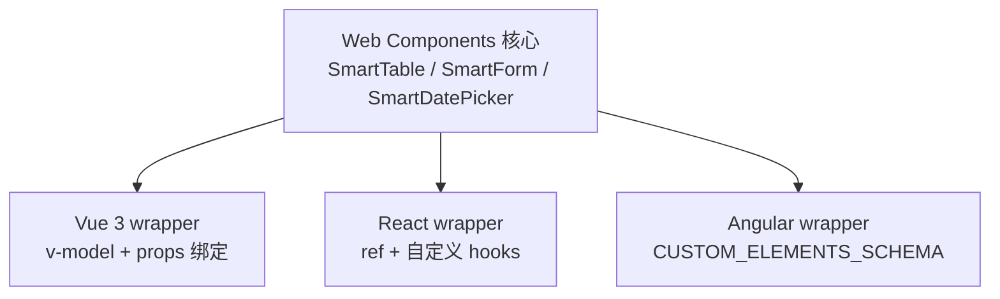
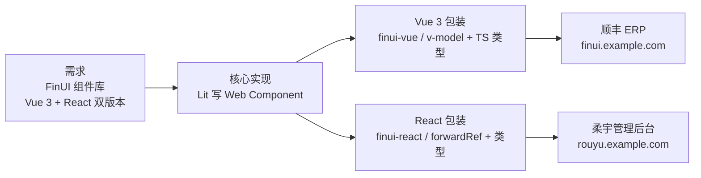

import Mermaid from '../../components/Blog/Mermaid';
import AIAsk from '../../components/Blog/AIAsk.astro';

## 前言

做前端架构的人要不要懂 Web Components？我的回答是 **要**——不是去用 Lit / Stencil，而是建立"跨框架组件库的核心抽象层"的工程判断。原因有三：

1. **简历里 8 个跨 Vue/React 通用组件是稀缺经验**。跨框架组件库的核心就是 Web Components + 框架 wrapper,**理解了能设计独立于框架的组件**。
2. **Web Components 是浏览器标准**。不像 React 只能 React 用，**Custom Elements 跑在所有框架里**——Vue / React / Angular / Solid / Svelte 都能消费。
3. **未来 5 年跨端组件库的趋势**。Lit 3.0 / Lit SSR / Web Components + Signals / 跨框架组件库设计,**底层都是 Web Components**。

这一篇是『前端架构修仙路』的第 20 篇。我跳过 Lit 的具体 API（不讲 `LitElement` 怎么继承），用架构图 + 设计哲学 + 真实案例，把 Web Components 三大技术 + 8 个跨框架组件的设计讲透。下一篇深度聊前端监控体系。

## 一、Web Components 三大技术

<Mermaid client:load caption="图 1：Web Components 三大技术栈" chart={`flowchart LR
  WC[Web Components] --> CE[Custom Elements<br/>自定义 HTML 标签]
  WC --> SD[Shadow DOM<br/>样式与结构隔离]
  WC --> ES[HTML Templates<br/>slot 插槽]`} />

**三大技术**：

1. **Custom Elements**：`customElements.define('my-tag', ...)` 注册自定义 HTML 标签
2. **Shadow DOM**：组件内的 DOM / 样式 / 行为完全隔离，**不影响外部**
3. **HTML Templates**：`<template>` + `<slot>` 实现可复用模板 + 内容分发

## 二、Custom Elements：定义自己的 HTML 标签

```javascript
// smart-table.ts —— 一个 Web Component
class SmartTable extends HTMLElement {
  static get observedAttributes() {
    return ['columns', 'data-source', 'page-size'];
  }
  
  connectedCallback() {
    this.render();
  }
  
  attributeChangedCallback() {
    this.render();
  }
  
  render() {
    const columns = JSON.parse(this.getAttribute('columns') || '[]');
    const dataSource = this.getAttribute('data-source');
    // 渲染表格
    this.shadowRoot.innerHTML = `
      <table>
        <thead>
          ${columns.map(c => `<th>${c.label}</th>`).join('')}
        </thead>
        <tbody>
          <slot></slot>
        </tbody>
      </table>
    `;
  }
}

customElements.define('smart-table', SmartTable);
```

**使用方式（任何框架）**：

```html
<!-- 纯 HTML -->
<smart-table columns="[{"key":"name","label":"姓名"}]" data-source="/api/users">
  <tr><td>Alice</td></tr>
</smart-table>

<!-- Vue 3 -->
<smart-table :columns="cols" :data-source="apiUrl">
  <tr v-for="row in data" :key="row.id"><td>{{ row.name }}</td></tr>
</smart-table>

<!-- React -->
<smartTable columns={JSON.stringify(cols)} dataSource="/api/users">
  {data.map(row => <tr key={row.id}><td>{row.name}</td></tr>)}
</smartTable>
```

**优势**：**一份组件,Vue / React / Angular / Solid 全能用**。

## 三、Shadow DOM：组件样式隔离

```javascript
class SmartTable extends HTMLElement {
  constructor() {
    super();
    this.attachShadow({ mode: 'open' });  // 0. Shadow DOM 附加
  }
  
  connectedCallback() {
    // 1. 样式只作用于 Shadow DOM 内部
    this.shadowRoot.innerHTML = `
      <style>
        .table { border-collapse: collapse; }
        th { background: #f0f0f0; padding: 8px; }
      </style>
      <table class="table">...</table>
    `;
  }
}
```

**Shadow DOM 三大好处**：

1. **样式隔离**：组件内部 `.button` 不会和外部 `.button` 冲突
2. **DOM 隔离**：组件内部 DOM 不会泄露到全局查询
3. **事件重定向**：组件内点击事件可以 `composed: true` 冒泡到外部

## 四、HTML Templates + Slot：内容分发

```html
<template id="smart-table-tpl">
  <style>.table { border-collapse: collapse; }</style>
  <div class="container">
    <slot name="header"></slot>  <!-- 具名 slot -->
    <table class="table">
      <slot></slot>  <!-- 默认 slot -->
    </table>
    <slot name="footer"></slot>
  </div>
</template>
```

**使用方传入内容**：

```html
<smart-table>
  <h1 slot="header">用户列表</h1>  <!-- 插入 header slot -->
  <tr><td>Alice</td></tr>           <!-- 插入默认 slot -->
  <button slot="footer">导出</button> <!-- 插入 footer slot -->
</smart-table>
```

**Slot 是 Web Components 版的 React children / Vue slot**,**跨框架一致**。

## 五、8 个跨 Vue/React 通用组件的设计哲学

简历里 **"8 个跨 Vue/React 通用组件"**——核心架构是 **Web Components 抽象 + 框架 wrapper**：



**架构师心法**：
- **Web Components 写核心逻辑**（状态管理、DOM 操作、事件分发）
- **框架 wrapper 只做适配**（props ↔ attribute 映射、事件 ↔ callback 映射）
- **业务代码用框架 wrapper**（开发体验 + 类型推导）

## 六、Lit / Stencil / 自实现选型

| 方案 | 优点 | 缺点 |
|---|---|---|
| **Lit** | 现代、TS 友好、生态活跃 | 学习曲线 |
| **Stencil** | 编译时优化、多框架输出 | 配置复杂 |
| **自实现 HTMLElement** | 零依赖、灵活 | 工作量大 |
| **Vue / React 包装 Web Components** | 复用已有组件 | 仍是各框架一份 |

**架构师决策**：
- **新项目、追求效率** → Lit
- **已有 Vue / React 组件库** → Stencil 编译输出
- **极致性能 / 零依赖** → 原生 HTMLElement

## 七、生产实战：FinUI 跨框架组件库



**生产数据**：
- **8 个跨框架通用组件**（SmartTable / SmartForm / SmartDatePicker / SmartSelect / SmartTree / SmartUpload / SmartModal / SmartEditor）
- **Vue 3 + React 双版本同步**（改核心一次,两边自动同步）
- **节省 60% 维护成本**（不需要为 Vue 写一套、React 写一套）

## 八、踩坑提醒（资深架构师请重点看）

1. **不要让 Shadow DOM 内的事件不冒泡**。默认 Shadow DOM 内的事件**不会冒泡到外部**——加 `composed: true` 才行。
2. **不要用全局 CSS 选择 Shadow DOM 内部**。Shadow DOM 隔离就是这点,无法用 `.my-component .button` 跨边界改样式。**要改就暴露 CSS Variables**（`--button-bg`）。
3. **不要让 framework wrapper 直接用 attribute**。**`null` 会被字符串化**——必须用 `getAttribute()` 判断 null。
4. **不要在 Web Component 里用框架的 state 管理**。**Web Component 是框架无关的**——用原生 `observedAttributes` 即可,不要混 Redux / Pinia / Zustand。
5. **不要忽视 SSR**。Web Components 默认 CSR,**SSR 需要 lit-ssr / 类似方案**。SEO 场景必须配置。

## 总结

这一篇用 6 个关键事实把 Web Components 串起来：

- **三大技术**:Custom Elements + Shadow DOM + HTML Templates,**浏览器原生,跨框架**。
- **Custom Elements**:自定义 HTML 标签,Vue/React/Angular/Solid 都能消费。
- **Shadow DOM**:样式与结构隔离,**零 CSS 冲突**。
- **Slot**:跨框架一致的内容分发机制。
- **跨框架组件库**:Web Components 核心 + 框架 wrapper,**8 个通用组件节省 60% 维护**。
- **选型决策**:新项目 Lit / 已有库 Stencil / 零依赖原生 HTMLElement。

**下一篇**:前端监控体系——错误 / 性能 / 行为监控,顺丰 + 柔宇两段监控沉淀实战。

## 5 道重点面试问题方向

> **Q1(答案)**:Web Components 三大技术是什么?为什么 Web Components 是跨框架组件库的核心抽象?
>
> **A**:三大技术:① **Custom Elements** — `customElements.define` 注册自定义 HTML 标签,Vue / React / Angular / Solid 都能用;② **Shadow DOM** — 组件内 DOM / 样式隔离,不会和外部 CSS 冲突;③ **HTML Templates + Slot** — 跨框架一致的内容分发机制。**为什么是跨框架核心抽象**:Web Components 是 **W3C 标准**,所有现代浏览器原生支持,**不被任何框架绑定**。**简历里 8 个跨 Vue/React 通用组件的核心架构就是**:Web Components 写核心逻辑 + Vue/React wrapper 做适配——改一次核心,两个框架同步,节省 60% 维护成本。<AIAsk question="Web Components 三大技术是什么?为什么 Web Components 是跨框架组件库的核心抽象?" />
>
> **Q2(思考)**:Shadow DOM 的样式隔离是怎么实现的?Web Components 内怎么让外部修改某些样式?
>
> **A**:Shadow DOM 通过 **CSS 隔离作用域**实现样式隔离——组件内 CSS 只作用于 Shadow DOM 内部,不会泄漏到外部。**但外部想修改某些样式**用 **CSS Variables**——组件定义 `var(--button-bg)`,外部 `style="--button-bg: red"` 就能改。**实战**:某跨框架组件库把所有颜色 / 间距 / 字号都暴露成 CSS Variables,业务方可以主题化定制而不破坏组件封装。<AIAsk question="Shadow DOM 的样式隔离是怎么实现的?Web Components 内怎么让外部修改某些样式?" />
>
> **Q3(思考)**:Custom Elements 的生命周期有哪些?怎么监听属性变化?
>
> **A**:Custom Elements 四个生命周期:① `constructor()` — 创建时调用,必须 `super()` 且**不能 return**;② `connectedCallback()` — 元素插入 DOM 时调用,**只调用一次**;③ `disconnectedCallback()` — 元素从 DOM 移除时调用,**清理副作用**;④ `attributeChangedCallback(name, oldValue, newValue)` — 属性变化时调用。**监听属性变化**:在 class 上定义 `static get observedAttributes()` 返回要监听的属性名数组,**只有这些属性的变化才会触发 `attributeChangedCallback`**。**生产坑**:`attributeChangedCallback` 在 `connectedCallback` 之前也会触发,**必须保证 `this.shadowRoot` 在那时已经初始化**。<AIAsk question="Custom Elements 的生命周期有哪些?怎么监听属性变化?" />
>
> **Q4(思考)**:Web Components 的事件冒泡和 React / Vue 的事件系统有什么不同?
>
> **A**:Web Components 事件冒泡受 **Shadow DOM 边界**影响——**默认 Shadow DOM 内的事件不会冒泡到外部**。要解决:① 事件 `composed: true` 让事件**穿透 Shadow DOM 边界**;② 事件 `bubbles: true` 让事件冒泡。**实战**:组件内点击按钮,`composed: true` 后外部才能监听到。**生产案例**:SmartTable 内部行点击事件,`composed: true` 冒泡到 Vue / React wrapper,业务代码用 `@row-click` / `onRowClick` 监听,**完全框架无关**。<AIAsk question="Web Components 的事件冒泡和 React / Vue 的事件系统有什么不同?" />
>
> **Q5(思考)**:你在 FinUI 跨框架组件库里是怎么设计 8 个通用组件的?Web Components 核心 + 框架 wrapper 的分工具体怎么落?
>
> **A**:**8 个通用组件 = SmartTable / SmartForm / SmartDatePicker / SmartSelect / SmartTree / SmartUpload / SmartModal / SmartEditor**。**分工**:Web Components 写**核心逻辑** — Shadow DOM 封装 + Custom Elements 注册 + observedAttributes 监听 props + slot 内容分发;框架 wrapper 只做**适配** — Vue 用 `defineComponent + v-model` / React 用 `forwardRef + useImperativeHandle`。**实战数据**:改一次核心,Vue 3 + React 双版本同步,节省 60% 维护成本——Vue 团队用 `finui-vue`,React 团队用 `finui-react`,组件库团队只维护一份 Lit 核心。<AIAsk question="你在 FinUI 跨框架组件库里是怎么设计 8 个通用组件的?Web Components 核心 + 框架 wrapper 的分工具体怎么落?" />

> 💡 每道题后面都有 AI 助手按钮,一键拿到详细答案。

## 参考资料

- [MDN: Web Components](https://developer.mozilla.org/en-US/docs/Web/Web_Components) — Web Components 官方参考
- [Lit Documentation](https://lit.dev/) — Lit 官方文档
- [Custom Elements (web.dev)](https://web.dev/articles/custom-elements-v1) — Custom Elements 实战指南
- [Shadow DOM (web.dev)](https://web.dev/articles/shadowdom-v1) — Shadow DOM 实战指南
- [Web Components Best Practices](https://web.dev/articles/best-practices-web-components) — Web Components 最佳实践
- [Open Web Components](https://open-wc.org/) — 开源 Web Components 社区